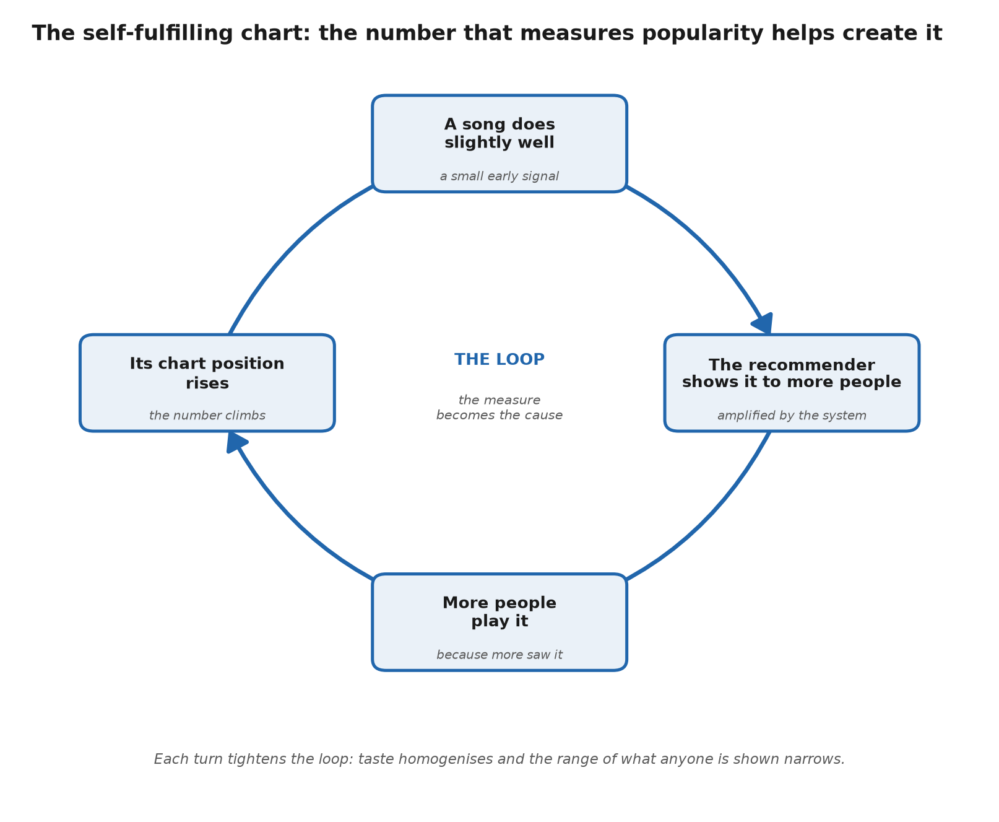

# Post 3: Garbage in, garbage out: how music data fools the people who trust it

*Angle: self-fulfilling prophecy and the limitations taxonomy. Feeds off sections 5 and 6 of the paper. Audience: data-curious general readers and industry.*

---

## Medium version

### Popularity feeds on popularity

*Why music charts are a feedback loop rather than a mirror, how that loop narrows what everyone hears, and how the same machinery gets gamed.*

We treat charts and streaming numbers as a mirror. They tell us what is popular, the way a thermometer tells us the temperature. Neutral, external, just reading off reality.

They are not a mirror. They are closer to a feedback loop, and once you see it you cannot unsee it.

Here is the loop. A song does slightly well, so the recommendation system shows it to more people. Because more people see it, it does better, so the system shows it to even more.

The number that was supposed to measure popularity is now helping create it. The chart is writing the story it claims to be reporting.

You can watch this happen with a real song. "Despacito" was already doing well on streaming in early 2017 before Justin Bieber jumped on the remix. Spotify's own head of Latin culture later said Bieber found the track precisely because it was so popular already. The remix and heavy playlisting then poured fuel on an existing fire, and the song sat at number one on the Billboard Hot 100 for sixteen weeks.

The point is not that "Despacito" was undeserving. It clearly connected with people. The point is that the platforms amplified a signal that was already there, and the amplification reshaped what everyone else heard: Spanish-language songs on the Hot 100 jumped from five in 2016 to nineteen in 2017. The loop does not just pick winners, it widens the gap between what gets pushed and what stays invisible.

### Why this is more than a nuisance

You might think, fine, the popular gets more popular, that has always been true. But the research shows something sharper and stranger.

Chaney and colleagues (2018) gave the effect a name, algorithmic confounding, and showed what it does. When a recommender learns from data that its own past recommendations created, everyone's taste drifts closer together, and, remarkably, the system gets worse at the job it was built to do. The loop is not just unfair to smaller artists. It is self-defeating for the platform too.

Mansoury and colleagues (2020) watched the mechanism run: feedback loops amplify popularity bias and steadily shrink the range of things anyone ever gets shown. The window narrows, quietly, over time.

### The honest complication

I want to be careful here, because the story is not one-sided, and pretending it is would be its own kind of garbage out.

Some studies point the other way. Datta and colleagues (2018) found that moving to streaming actually widened what individual listeners explored, compared with owning music. And a large Spotify study by Anderson and colleagues (2020) found that algorithmic listening increased how much people consumed but was linked to less variety in what they heard.

So the effect is real and measurable, but it is a tension, not a verdict. The same systems that homogenise can also expose you to things you would never have found alone. The honest answer is that both are true at once, so treat any tidy, one-way story with suspicion.

### Four ways the numbers mislead

Once you accept that the data is not a clean mirror, it helps to know the specific ways it distorts. There are four families.

Fragmentation is the patchiness of the signal. Not every platform reports every artist, VPNs scramble the geography, offline listening is mostly invisible, and even logged behaviour is thin. A skip gets recorded; the reason for it does not.

Bias is about interpretation. Vanity numbers like followers and likes stand in for engagement they do not measure, correlation gets read as causation, and the crowd generating the data is not the crowd you care about. TikTok's users skew young and female in ways that do not represent the audience for plenty of genres.

Automation is the feedback loop above: systems that cannot tell passive listening from active, that favour the mainstream, and that throw off spikes having nothing to do with quality.

Lack of standards is the missing shared vocabulary. A "stream" is not the same event on Spotify as on Apple Music, data sits siloed by platform, and every number is open to gaming, bots, and coordinated campaigns.

### And now people are faking the inputs on purpose

The feedback loop was an accidental distortion. The newest problem is deliberate, and it has an economy behind it.

To see why anyone bothers, you need to know how streaming pays. Almost every big platform uses a pooled model, sometimes called streamshare. All the subscription and advertising money for the month goes into one pot, and each rights-holder gets a slice sized by their share of total streams.

Your payout is not tied to what your fans paid. It is your fraction of everyone's listening.

That design turns a fake stream into theft from a shared pool. Every bot play does two things at once: it earns money for whoever ran it, and it shrinks the slice left for everyone with real listeners. Nobody has to lose a track for a working musician to be quietly underpaid.

The scale is the uncomfortable part. In 2024 a musician was charged in the United States with using AI to generate thousands of songs and armies of bots to stream them, siphoning off around ten million dollars in royalties. That was one person. The fraud-detection firm Beatdapp estimates that at least ten percent of all streams are fake, which it reckons drains somewhere between two and three billion dollars a year from the pool.

Even the cautious numbers sting. A 2023 study in France found only one to three percent of streams there were fake, but scaled worldwide that alone would be up to half a billion dollars in misdirected royalties. Set against the 14.9 billion dollars US streaming earned in 2024, a "small" fraud rate is still a very large sum taken from real artists.

And it is not a local quirk. A man was convicted of streaming fraud in Denmark and jailed for two years; in Brazil, someone allegedly uploaded more than 400 fake tracks and racked up over 28 million plays. When both the songs and the listening can be manufactured cheaply, the numbers stop being merely noisy. They become corruptible by anyone with a reason to corrupt them, and the pooled model quietly rewards them for trying.

### The courts are starting to force the issue

There's a legal angle worth adding, because it could change what feeds the machine in the first place. When AI generators train on unlicensed music, that's garbage in on a massive scale, and, as I've argued elsewhere, nobody can reliably prove which songs went in afterwards.

The labels took this to court. They sued the big generators, Suno and Udio, in 2024. By late 2025 the deals began: Universal settled with Udio, Warner settled with both, and Sony is still fighting.

The interesting part for data quality is what a licensing deal does. It turns an untracked scrape into a documented, permissioned input. If that becomes the norm, keeping proper records of what a model learned from stops being optional. If the courts instead wave it through as fair use, the reason to document anything largely disappears.

### The takeaway

Charts and streaming numbers are useful. They are also produced by systems with their own incentives, their own blind spots, and now their own attackers. Read them as a mirror and they will fool you. Read them as one noisy signal among many, made by machinery you cannot fully see, and you will make better decisions.

*This is part of a longer paper on how the music industry measures itself and where those measurements break. The full version, with sources and figures, is here: [github.com/isabella-pighi/Liner-Notes](https://github.com/isabella-pighi/Liner-Notes). This work grew out of a talk, "From Data Deluge to Data Strategy: Get the Power of Insights," that I gave with Chiara Santoro at [SXSW 2025](https://schedule.sxsw.com/2025/events/PP153768).*

---

## Substack version

### Popularity feeds on popularity

*Why music charts are a feedback loop rather than a mirror, how that loop narrows what everyone hears, and how the same machinery gets gamed.*

We treat charts and streaming numbers as a mirror. They tell us what's popular the way a thermometer tells us the temperature: neutral, external, just reading off reality.

They're not a mirror. They're closer to a feedback loop, and I want to take that apart carefully, because the failure mode it hides is subtle, well-studied, and getting worse.

Here's the loop in one breath. A song does slightly well, so the recommender shows it to more people, so it does better, so the recommender shows it to even more. The number that was meant to measure popularity is now helping create it. The chart is writing the story it claims to be reporting.

It helps to anchor this in a song everyone knows. "Despacito" was already a genuine streaming hit in early 2017 before Justin Bieber joined the remix. According to Spotify's head of Latin culture at the time, Bieber discovered the track because it was already so popular, which is the loop starting from a real signal rather than a fake one. The remix plus aggressive playlist placement amplified that signal hard, and the song spent sixteen weeks at number one on the Billboard Hot 100, the first time two Spanish-language songs sat together in the chart's upper reaches.

I am not calling "Despacito" manufactured. It was popular on its own merits, and that is exactly why it is the honest version of the example: the loop does not need fraud to distort the picture. It amplifies whatever it is fed, and the amplification changes the field.

In 2016 there were five predominantly Spanish-language songs on the Hot 100 across the year; in 2017 there were nineteen. A single amplified hit helped reset which songs the recommendation-and-playlist machinery would carry next, which is the homogenisation effect made visible in real chart data.

### The loop has a name, and it's worse than unfair

Recommendation systems learn from user behaviour. But that behaviour was itself shaped by earlier recommendations, so the system ends up learning from data it partly generated. That closed circle between what gets shown and what gets measured as popular is the whole problem.

Chaney, Stewart and Engelhardt named it in 2018: algorithmic confounding. They showed two consequences, and the second is the one that should make platforms nervous. First, homogenisation: everyone's behaviour drifts closer together as the loop tightens.

Second, and far less obvious, degraded utility: a recommender trained on its own confounded output gets worse at the job it was built for. The loop isn't just unfair to smaller artists. It's self-defeating for the platform too.

Mansoury and colleagues watched the mechanism run in 2020, and found feedback loops amplify popularity bias and steadily shrink the range of things anyone ever gets shown. The window narrows, quietly, over time.

If you want the full map of these biases and the fixes people have proposed, the survey by Chen and colleagues (2023) is the standard reference, and its real contribution is turning a vague fairness worry into a defined engineering problem you can actually work on.

### Music saw this first

Here's a detail I like, because it flips the usual order. The structural outcome of all this, a few superstars and an enormous tail of everyone else, was measured in music before it was theorised for recommenders generally.

Celma and Cano traced in 2008 how popularity concentrates inside the recommendation network itself, and Celma's *Music Recommendation and Discovery* (2010) is still the standard treatment of the long-tail problem. The thing the whole field now worries about showed up in the streaming data early.

### The honest complication

I want to be careful here, because the story isn't one-sided, and pretending it were would be its own kind of garbage out.

Some solid studies point the other way. Datta, Knox and Bronnenberg found in 2018 that moving to streaming actually widened what individual listeners explored, compared with owning music. And the large Spotify study by Anderson and colleagues in 2020, which is really the empirical heart of this argument, compared algorithmic with self-directed listening and found the algorithm increased how much people consumed but was linked to less variety in what they heard.

So the synthesis is a tension, not a verdict. The homogenising effect is real and measurable, and it coexists with genuine discovery benefits. The same systems that flatten taste can also hand you something you'd never have found alone. The honest answer is that both are true at once, so treat any tidy, one-way story with suspicion.

### Four ways the numbers mislead

Once you accept the data isn't a clean mirror, it helps to name the specific ways it distorts. Naming them turns "data quality" from a vague unease into a checklist. There are four families.

Fragmentation is the state of the signal. Not every platform reports every artist, VPNs scramble the geography, offline listening is mostly invisible, and even logged behaviour is thin: a skip gets recorded, the reason for it doesn't.

Bias is about interpretation. Vanity numbers like followers and likes stand in for engagement they don't measure, correlation gets read as causation, and the crowd generating the data isn't the crowd you care about. TikTok's users skew young and female in ways that don't represent the audience for plenty of genres.

Automation and algorithmic influence is the feedback loop above, plus systems that can't tell passive listening from active, that favour the mainstream, and that throw off spikes with nothing to do with quality.

Lack of standards is the missing shared vocabulary. A "stream" isn't the same event on Spotify as on Apple Music, data sits siloed by platform, measurement windows are short, and every number is open to playlist gaming, bots, and coordinated campaigns.

These aren't independent problems. They're better held as a set of demands that any fair way of normalising music data would have to satisfy at once, which is exactly why nobody has managed it: every normalisation effort so far has been local and arbitrary, with proprietary indices collapsing a many-sided performance into one debatable score.

### And now people are faking the inputs on purpose

Everything above is accidental distortion, a byproduct of how the machinery works. The newest problem is deliberate, and it pays well enough to have become an industry.

Start with the incentive, because the payout model is what makes fraud rational. Almost every major service runs a pooled, or "streamshare," system: all the subscription and advertising revenue for a period goes into one pot, and each rights-holder is paid according to their share of total streams. Your income is not a function of what your own listeners spent. It is your proportion of everyone's plays.

That structure has a nasty property. A stream is a claim on a fixed pool, not merely a data point that can be faked. So every fraudulent play does double damage: it pays whoever generated it, and it dilutes the per-stream rate for everyone with real audiences.

The fraudster is not inventing new money. They are redistributing a shared pot toward themselves, and the loss is spread thinly enough across honest artists that almost nobody notices their own cut shrinking.

Then look at the volume. In 2024 a musician was charged in the United States with using AI-generated tracks and armies of bots to stream them, siphoning off around ten million dollars in royalties; he pleaded guilty in 2026. That was a single operator. The fraud-detection firm Beatdapp estimates that at least ten percent of all streams are fraudulent, and puts the annual drain on the royalty pool at between two and three billion dollars.

Treat those figures with proper caution, because measuring fraud is itself a measurement problem, and the estimators are not disinterested. A 2023 study in France found a much lower one to three percent of streams were fake. Even that conservative range, scaled globally, would divert up to about 510 million dollars a year, and against the 14.9 billion dollars US recorded-music streaming generated in 2024, a "low" fraud rate is still a fortune skimmed from real rights-holders. The honest position is that the true number is unknown and contested; what is not in doubt is that it is large and structural.

It is also global and prosecutable, not a fringe stunt. A 53-year-old was convicted of streaming fraud in Denmark and sentenced to two years; in Brazil, someone allegedly uploaded more than 400 fake tracks and generated over 28 million plays. Cheap generative audio has lowered the cost of the "product" to almost nothing, so the fake-track-plus-bot-farm playbook now scales in a way it never could when a human had to make the music.

Here is the point for anyone modelling this data. When both the content and the listening can be manufactured at scale, streaming counts are not merely noisy, they are adversarially corrupted, and the pooled payout actively rewards the corruption. Any model built on raw stream counts inherits that attack surface whether its authors realise it or not, and it inherits an incentive structure that guarantees the attacks keep coming.

### The courts are starting to force the issue

There's a legal front to all this, and it matters because it could change what goes into the machine in the first place.

When AI generators train on unlicensed recordings, that's garbage in at industrial scale: the model absorbs work it had no right to, and, as I've written elsewhere, nobody can reliably prove after the fact which specific songs went in. The record labels went at this directly. In June 2024 the RIAA sued the two leading music generators, Suno and Udio, for mass infringement.

By late 2025 the majors began settling. Universal settled with Udio in October 2025 and lined up a licensed AI music service for 2026. Warner settled with both Udio and Suno in November 2025, with licensing deals attached. Sony held out and, as the last major still litigating, is pushing toward a ruling, with a summary-judgment fight in the Massachusetts Suno case expected to test the fair-use question in 2026.

Here's why a data person should care. A settlement with a licensing deal turns an untracked scrape into a documented, permissioned input. That's the difference between garbage in and clean in.

If licensing becomes the norm, provenance and consent metadata stop being optional and become the price of doing business, which is exactly the fix the rest of this argument points to. If instead a court blesses training on unlicensed data as fair use, the incentive to document anything largely evaporates. Either way, the quality of what future models learn from is being decided in these rooms right now.

### Why this is actionable, not just cautionary

The practical upshot is a stance toward the numbers. Treat streaming metrics as one noisy, self-referential, manipulable signal, produced by systems with their own incentives and their own blind spots, rather than as ground truth. Read them as a mirror and they'll fool you. Read them as one signal among many, made by machinery you can't fully see, and you'll make better calls.

That reframing is the bridge to strategy. It's exactly why the sequel to this work argues for causal methods and owned, first-party data instead of a dashboard of platform counts.

*Full paper, figures, and complete bibliography: [github.com/isabella-pighi/Liner-Notes](https://github.com/isabella-pighi/Liner-Notes). This post draws on the feedback-loop and limitations sections. This work grew out of a talk, "From Data Deluge to Data Strategy: Get the Power of Insights," that I gave with Chiara Santoro at [SXSW 2025](https://schedule.sxsw.com/2025/events/PP153768).*

---

## LinkedIn note

We treat streaming charts like a thermometer. They're actually a feedback loop.

A song does well, so the algorithm pushes it, so it does better, so the algorithm pushes it more. The number meant to measure popularity is helping create it. Researchers call it algorithmic confounding.

New post on how the charts don't just measure popularity, they help create it, from our SXSW 2025 talk.

[Medium] · [Substack] · github.com/isabella-pighi/Liner-Notes
