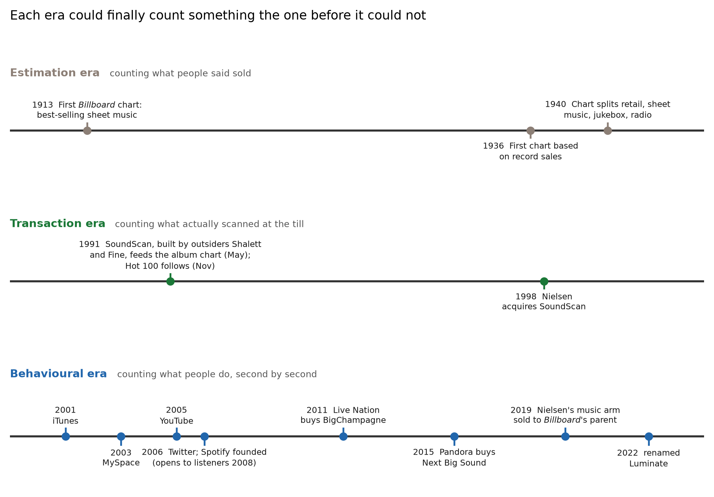

# Post 4: A short history of counting music, from Billboard to Luminate

*Angle: the narrative "how we got here". Feeds off section 2 of the paper. Audience: general readers and industry, a lighter storytelling piece.*

---

## Medium version

### Before it was a data business, it was a back-office chore

Every argument about streaming numbers, AI training data, and who owns your listening habits rests on a machine that was built, quietly and over decades, to answer a much smaller question: who should get paid?

That, more or less, is the whole origin story. A vast surveillance apparatus, the one that knows what you played at 2am and how many seconds in you skipped, started life as an accounting department. Worth tracing how it grew, because the shape of the machine explains a lot about why today's numbers behave the way they do.

*Three eras of counting. Each one could finally measure something the era before it could not, and each brought a new blind spot with it.*

### 1913: someone starts keeping score

Weekly popularity tracking is older than most people assume. *Billboard* published its first chart, a list of best-selling sheet music, back in July 1913, and its first chart based on actual record sales on 4 January 1936. The method, for decades afterwards, was reported estimates and educated guesswork. The industry took its own temperature and trusted the reading, and for more than half a century that was more or less how it worked: whoever made and sold the music also told everyone how well it was selling. You can imagine the room for wishful thinking.

### 1991: the barcode changes everything

The real turning point came in 1991, when Billboard began building its album chart from SoundScan, a system built by two outsiders, the industry veteran Michael Shalett and the pollster Michael Fine, that swapped the guesswork for barcode scans at the register. (The company was bought later by the group that became Nielsen, which is why the name is usually remembered as Nielsen SoundScan.) Bigger deal than it sounds: the charts became a record of actual transactions rather than the industry's own say-so, and sales you could count replaced sales people claimed. It arrived in stages, the album chart in May 1991 and the Hot 100 that November, and the effect was immediate enough to unsettle everyone who had grown comfortable with the old numbers. It reset who got to define success, and it is the moment music measurement finally grew a spine.

### The internet adds a second thing to count

Then the internet arrived and introduced a new question, no longer just what people bought but what they listened to, and the signals multiplied fast.

BigChampagne started reporting the most-shared files on Napster. iTunes landed in 2001, MySpace in 2003, YouTube in 2005, Twitter in 2006. Spotify was founded that same year, though it did not open to listeners until 2008 and only reached the United States in 2011. Then, eventually, TikTok. Each one turned music into something you navigate through enormous libraries.

Here is the sleight of hand at the centre of the whole story. If you want people to find their way through a hundred million tracks, you have to give them playlists, recommendations, and search, and every one of those tools is also a sensor, quietly writing down what they do. The features that help you listen are the same features that measure you, which is how the industry ended up running on the kind of behavioural analytics that tech companies live on rather than just sales figures. Nobody sat down and designed a surveillance system; it accreted, one convenience feature at a time, until the by-product became more valuable than the thing it was a by-product of.

### The industry grows up around the data

As the data got valuable, companies started buying each other to control it.

Live Nation swallowed BigChampagne in 2011. Pandora bought Next Big Sound in 2015. Apple picked up Semetric, the company behind Musicmetric. And Nielsen's music arm was sold to Billboard's parent in 2019, becoming MRC Data and then, in 2022, Luminate. Around them, a set of independent analytics firms grew up, Chartmetric, Soundcharts, Songstats among them, all competing to turn a scattered mess of signals into something worth paying for.

Whoever controls the count controls the story.

### One claim worth handling with care

You will sometimes hear that music is now worth more than film. It traces to the economist Will Page, whose annual *Global Value of Music Copyright* report put music copyright at $45.5bn for 2023, ahead of the $33.2bn global cinema box office that year.

Handle the line with care, though, because it is a good example of a number that gets flattened in the retelling. That $45.5bn is total copyright value: recorded music, songwriter collections, and publishing combined. Recorded music on its own was about $28.5bn, which is actually below the box office. And it is not a clean like-for-like comparison in the first place. A memorable number travels further than a careful one, which is worth remembering whenever a music statistic is quoted at you.

### Where it leaves us

Direction of travel is not in doubt. Measuring music has gone from a quiet back-office job about royalties to a front-office business about intelligence.

That shift is the reason all the modern arguments exist. Once listening became the product, everything downstream, the charts, the recommendations, the AI training sets, became a fight over data. Knowing where the machine came from makes those fights much easier to follow.

*This is the opening thread of a longer paper on how the music industry measures itself. The full version, with sources and figures, is here: [github.com/isabella-pighi/Liner-Notes](https://github.com/isabella-pighi/Liner-Notes). This work grew out of a talk, "From Data Deluge to Data Strategy: Get the Power of Insights," that I gave with Chiara Santoro at [SXSW 2025](https://schedule.sxsw.com/2025/events/PP153768).*

---

## Substack version

### From a back-office chore to a data business: how music learned to count itself

It's easy to argue about streaming metrics and AI training data as if they appeared out of nowhere, but they didn't. They're the newest layer on a machine that has been quietly accreting since 1913, and the history is genuinely useful, because each layer left a fingerprint on how today's numbers behave.

Here's the whole origin story in one line. The vast surveillance apparatus of modern music, the one that knows what you played at 2am and how many seconds in you skipped, started life as an accounting department trying to answer a small question, who should get paid, and everything else, the charts, the playlists, the training sets, grew on top of that original ledger.

*Three eras of counting. Each one could finally measure something the era before it could not, and each brought a new blind spot with it.*

### When the industry marked its own homework (1913 to 1991)

Weekly popularity tracking is older than most people assume. *Billboard* ran its first chart in July 1913, a ranking of best-selling sheet music, and its first record-sales chart on 4 January 1936. By July 1940 it was publishing a "Music Popularity Chart" that broke out retail sales, sheet music, jukebox selections and radio play separately. What none of it had was a way to observe a sale directly. Reported estimates and educated guesswork was the method: the industry took its own temperature and mostly trusted the reading.

Sit with that for a second, because it's the original sin. Whoever was invested in a record's success also happened to be the source of the numbers describing it, an obvious conflict of interest that the industry simply lived with for over five decades.

You can imagine the room for wishful thinking.

### The barcode grows a spine (1991)

Then a barcode scanner rewired the whole thing.

Billboard started building its album chart from SoundScan, a system created not by the industry or the magazine but by two outsiders, the industry veteran Michael Shalett and the pollster Michael Fine, which swapped the guesswork for barcode scans at the register.

Ownership matters here. SoundScan started as an independent company. It was later bought by the Dutch publisher VNU, which renamed itself The Nielsen Company in 2007, and that is why history remembers the system as Nielsen SoundScan.

Bigger deal than it sounds. Charts became a record of actual transactions rather than the industry's own say-so, sales you could count replaced sales people claimed, and the authority to define a hit shifted from a reporting desk to an auditable till receipt. Adoption was phased rather than instant, with the album chart moving in May 1991 and the Hot 100 following that November. For the first time music measurement was empirical rather than declarative, it reset who got to decide what success even meant, and the effects of that one change still ripple through every chart argument we have today.

### Listening becomes the thing being counted (2000s onward)

Then the internet arrived and quietly changed the question, no longer just what people bought but what they listened to, and the signals multiplied fast.

BigChampagne started reporting the most-shared files on Napster. Then a rapid sequence: iTunes in 2001, MySpace in 2003, YouTube in 2005, Twitter in 2006, Spotify founded the same year but not open to listeners until 2008 (and not in the United States until 2011), and eventually TikTok. Each one turned music into a navigation problem across an enormous library.

Here's the sleight of hand at the centre of the whole story. If you want people to find their way through a hundred million tracks, you have to give them playlists, recommendations, and search, and every one of those tools is also a sensor, quietly writing down what they do, so the features that help you listen turn out to be the same features that measure you, and the industry ends up running on the kind of behavioural analytics that tech companies live on rather than plain sales figures. Nobody designed it that way on purpose; it accreted one convenience at a time until the by-product, the data, quietly became worth more than the listening it was a by-product of.

This is where the critical scholarship earns its place. Eric Drott framed streaming as a form of surveillance in 2018 and developed it fully in *Streaming Music, Streaming Capital* (2024), where the argument is that the listening data isn't exhaust, it's the product being sold. *Spotify Teardown* (Eriksson and colleagues, 2019) went further and reverse-engineered one platform's counting machine from the outside, which is exactly why it's fair to treat these metrics as black boxes rather than clear windows onto reality.

### The industry grows up around the data (2010s onward)

As the data became the asset, companies started buying each other to control it. Live Nation swallowed BigChampagne in 2011, Pandora bought Next Big Sound in 2015, Apple picked up Semetric (the company behind Musicmetric), and Nielsen's music arm was sold to Billboard's parent company in 2019, becoming MRC Data before being renamed Luminate in 2022. Note the shape of that last one: the measurement business ended up back under the same roof as the chart it feeds. Around them a set of independent analytics firms grew up, Chartmetric, Soundcharts and Songstats among them, all competing to turn a scattered mess of signals into something worth paying for. Whoever controls the count controls the story.

### One claim worth handling with care

You'll sometimes hear that music is now worth more than film. It traces to the economist Will Page (former chief economist at Spotify), whose annual *Global Value of Music Copyright* report put the total value of music copyright at $45.5bn for 2023, ahead of the $33.2bn taken at the global cinema box office that year. It is a real finding, but it is exactly the kind of number that gets mangled in the retelling. That $45.5bn is everything combined: recorded music, collective-management-organisation collections, and direct publisher income. Recorded music alone was around $28.5bn, comfortably below the box office, and even the topline is not a strict like-for-like comparison. I flag it on purpose, because a memorable number travels much further than a careful one, and repeating it uncritically is exactly the data-literacy failure the rest of this work is about.

### Why the history is load-bearing

Direction of travel isn't in doubt: a back-office royalty function became a front-office intelligence business, and each phase left something behind that still shapes how the numbers misbehave.

The estimation era left a lingering tolerance for self-reported figures. The transaction era left the assumption that a count equals truth. The behavioural era left us metrics that are really instrumentation, produced by systems with their own incentives. And consolidation left the data concentrated in a handful of black-box providers.

Every current controversy, the meaning of a stream, the fairness of recommendations, the legality of AI training sets, is really a dispute over that inherited machine, and once listening itself became the product, everything downstream turned into a fight over data. Knowing how the machine was built, which corner was cut in which decade and why, is the cheapest way to reason about where it breaks next.

*Full paper, figures, and complete bibliography: [github.com/isabella-pighi/Liner-Notes](https://github.com/isabella-pighi/Liner-Notes). This post expands the historical section. This work grew out of a talk, "From Data Deluge to Data Strategy: Get the Power of Insights," that I gave with Chiara Santoro at [SXSW 2025](https://schedule.sxsw.com/2025/events/PP153768).*

---

## LinkedIn note

The whole data machine behind modern music was built to answer a boring question: who should get paid?

Billboard's sheet-music rankings in 1913. SoundScan in 1991, when a count first beat a claim. Then the internet made listening itself the thing being measured.

New post: a short history from Billboard to Luminate, out of our SXSW 2025 talk.

[Medium] · [Substack] · github.com/isabella-pighi/Liner-Notes
